## Summary

This portfolio showcases my professional work in software development, highlighting my contributions to web and mobile applications using technologies like Node.js, Next.js, Typescript, Android, Java, and Kotlin. Additionally, I also have experience, implementing CI/CD pipelines tailored to budget and specific requirements, tools and platforms such as Linux instances, AWS products, Docker Hub, and more.

## Projects

### CompMoto POS

_Jan 2025 - Present_

**Description:**

POS Stock Management with Microsoft Dynamics (Cloud ERP) Synchronization for Automotive Parts, Products, and Services.

**Responsibilities:**

- Developed APIs for dashboard, cashier, and emailing systems.
- Built parts of CMS frontends and assisted the team in validating business logic.

**Technologies:** [Next.js v15.0.2](https://github.com/vercel/next.js/), [nextui](https://github.com/nextui-org/nextui), [next-auth](https://github.com/nextauthjs/next-auth), [prisma](https://github.com/prisma/prisma), [CASL](https://github.com/stalniy/casl), [tailwindcss](https://github.com/tailwindlabs/tailwindcss)

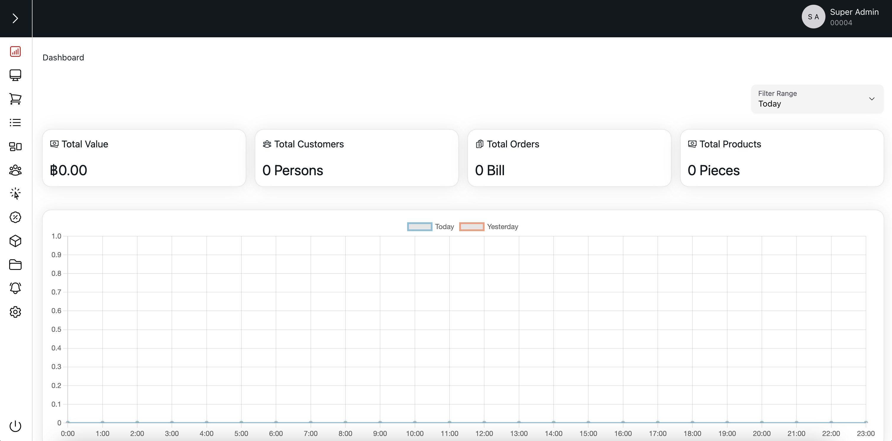

---

### Easyhealth

_Jun 2024 - Present_

**Description:**

An e-commerce platform for healthy food products, featuring web and mobile apps with customizable meal bowls and detailed micronutrient information.

**Responsibilities:**

- Integrate Kosmo Delivery for rider location tracking.
- Implement app notification API.
- Collaborate with mobile app team on payment gateway integration.

**Technologies:** [Next.js v15.1.6](https://github.com/vercel/next.js/), [heroui](https://github.com/heroui-inc/heroui), [next-auth](https://github.com/nextauthjs/next-auth), [prisma](https://github.com/prisma/prisma), [tailwindcss](https://github.com/tailwindlabs/tailwindcss), [Stripe v17.0.0](https://github.com/stripe/stripe-node), [Kosmo Delivery](https://kosmo.readme.io/reference/whats-kosmo)

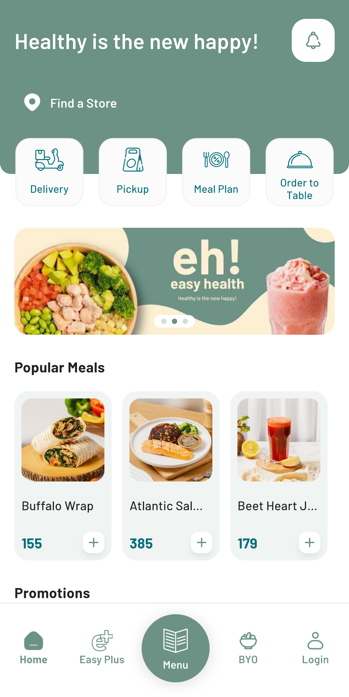

---

### Mewing App

_May 2024 - Present_

**Description:**

Subscription-Based Video Service for Mewing Content on Mobile App and Website.

**Responsibilities:**

- Developed data synchronization with the Klaviyo marketing platform.
- Implemented a payment gateway integration using Stripe.
- Built APIs for mobile app and web front-end.
- Contributed to the development of the web front-end.

**Technologies:** [Next.js v15.0.2](https://github.com/vercel/next.js/), [nextui](https://github.com/nextui-org/nextui), [next-auth](https://github.com/nextauthjs/next-auth), [prisma](https://github.com/prisma/prisma), [tailwindcss](https://github.com/tailwindlabs/tailwindcss), [Klaviyo](https://github.com/klaviyo/klaviyo-api-node), [Stripe v17.4.0](https://github.com/stripe/stripe-node)

**Link:** [Website](https://web.mewingapp.co/home), [iOS](https://apps.apple.com/gb/app/mewing-by-dr-mike-mew/id1562833932), [Android](https://play.google.com/store/apps/details?id=com.orthotropics.mewing)

## 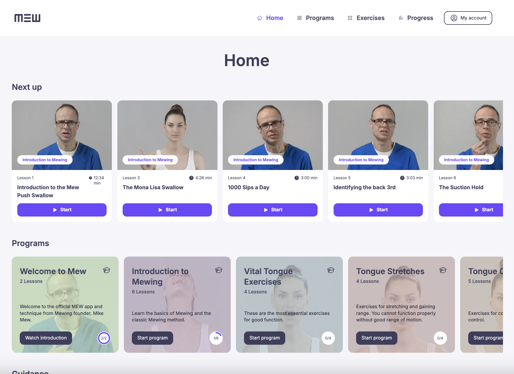

---

### El Mercado

_Jun 2023 - Present_

**Description:**

An e-commerce platform for a Mediterranean restaurant, featuring mobile apps with delivery and dine-in options, including customizable choices, side dishes, and more, integrated with Oracle NetSuite (Cloud ERP) for synchronization.

**Responsibilities:**

- Developed multiple APIs to support mobile and web front-end features and functionality.
- Implemented and managed the full payment gateway integration process.
- Managed CI/CD pipelines to ensure efficient and reliable deployment workflows.
- Collaborated closely with the mobile app development team to align on project goals and deliverables.

**Technologies:** [Next.js v13.5.6](https://github.com/vercel/next.js/), [headlessui](https://github.com/tailwindlabs/headlessui), [next-auth](https://github.com/nextauthjs/next-auth), [prisma](https://github.com/prisma/prisma), [tailwindcss](https://github.com/tailwindlabs/tailwindcss), [Stripe v12.18.0](https://github.com/stripe/stripe-node)

**Link:** [iOS](https://apps.apple.com/th/app/el-mercado/id6468034312), [Android](https://play.google.com/store/apps/details?id=com.sybarite.elmercado)

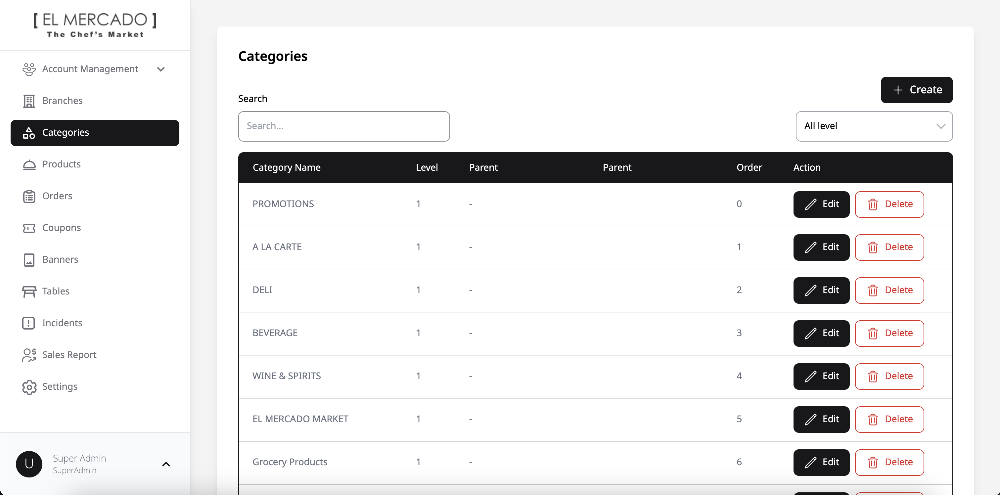

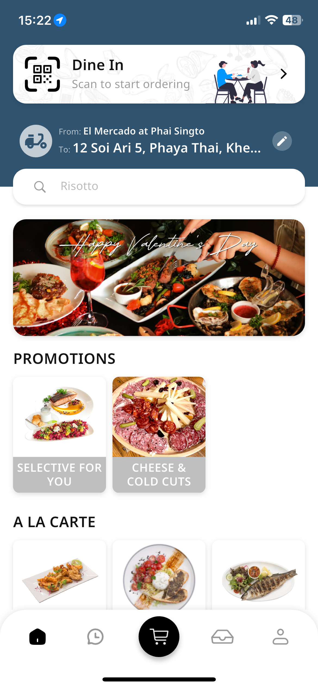
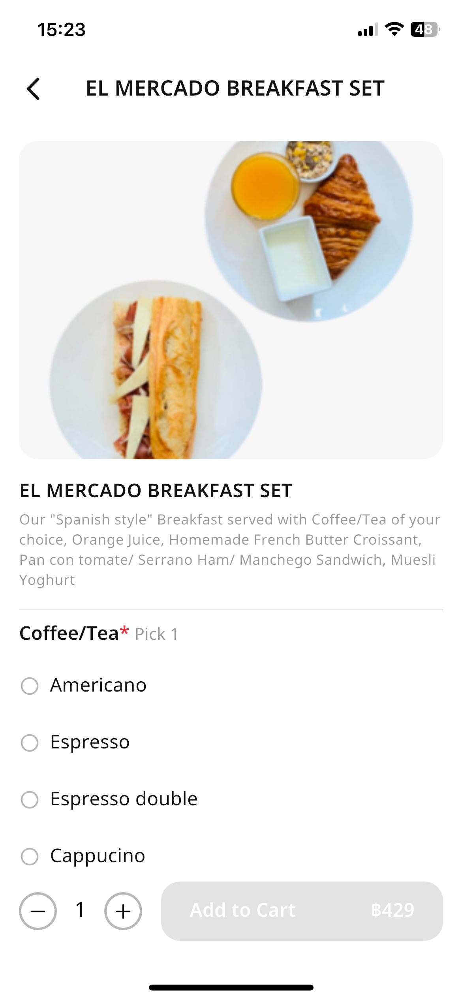

---

### Link2Team

_Mar 2023 - Present_

**Description:**

A application designed for internal social communication in corporate, supporting posts, surveys, and comments. Includes an anonymous mode for user privacy.

**Responsibilities:**

- Developed all mobile APIs, including authentication, post, like/unlike, notification, and more.
- Developed web front-end APIs for the CMS.
- Managed CI/CD pipelines to ensure efficient and reliable deployment workflows.
- Served as the main developer collaborating with the front-end team.

**Technologies:** [Next.js v13.4.8](https://github.com/vercel/next.js/), [headlessui](https://github.com/tailwindlabs/headlessui), [next-auth](https://github.com/nextauthjs/next-auth), [prisma](https://github.com/prisma/prisma), [tailwindcss](https://github.com/tailwindlabs/tailwindcss), [twin.macro](https://github.com/ben-rogerson/twin.macro)

**Link:** [Website](https://www.link2team.com/), [Android](https://play.google.com/store/apps/details?id=com.smartsoftasia.link2teamapp)

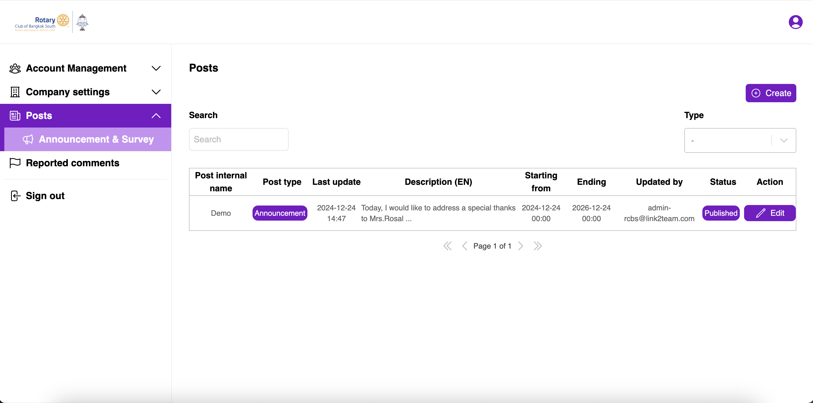

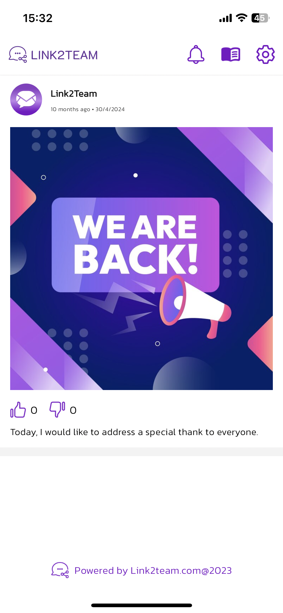

---

### AI Accounting

_Jan 2023 - Present_

**Description:**

A web application that uses an AI model to recognize a bill or receipt, pre-fill the data, and upload it to Xero accounting services.

**Responsibilities:**

- Design a workflow for a team.
- Develop a proof of concept (POC) for a Xero SDK.
- Manage CI/CD pipelines and the GCP platform.

**Technologies:** [Next.js v14.1.0](https://github.com/vercel/next.js/), [RadixUI](https://github.com/radix-ui/themes), [next-auth](https://github.com/nextauthjs/next-auth), [prisma](https://github.com/prisma/prisma), [tailwindcss](https://github.com/tailwindlabs/tailwindcss), [xero-node](https://github.com/XeroAPI/xero-node)

**Link:** [Website](https://daos-ai.smartsoftasia.com)

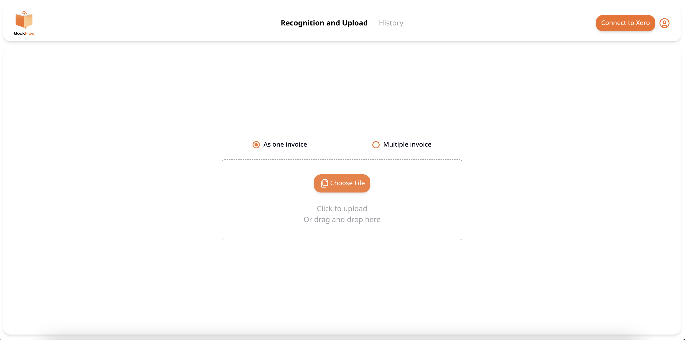

---

### JustCar

_Aug 2022 - Jul 2023_

**Description:**

A platform for buying and selling used cars, offering a wide range of vehicle models and years, Additionally, JustLoan provides loan services to support customers with tailored financial solutions.

**Responsibilities:**

- Set up a server with CI/CD pipelines using cloud services.
- Developed several feature APIs for a Content Management System (CMS).
- Assisted other teams with small tasks as needed.

**Technologies:** [Next.js v12.2.5](https://github.com/vercel/next.js/), [prisma](https://github.com/prisma/prisma), [next-auth](https://github.com/nextauthjs/next-auth), [CASL](https://github.com/stalniy/casl), [tailwindcss](https://github.com/tailwindlabs/tailwindcss), [headlessui](https://github.com/tailwindlabs/headlessui)

---

### Rabbit Rewards (Subscription)

_Mar 2022 - Oct 2024_

**Description:**

An API service for a Mobile and CMS applications that handles a subscription model, connecting with multiple payment gateways and internal services.

**Responsibilities:**

- Initialize a project using Node.js with Express.
- Develop all mobile APIs according to the requirements.
- Develop CMS APIs according to the requirements.
- Implement payment gateways.
- Architect the project for cloud services to handle high usage.
- Optimize project performance.
- Efficiently assigned tasks to quickly implement required changes and add features, meeting project deadlines.

**Technologies:** [Express](https://github.com/expressjs/express)

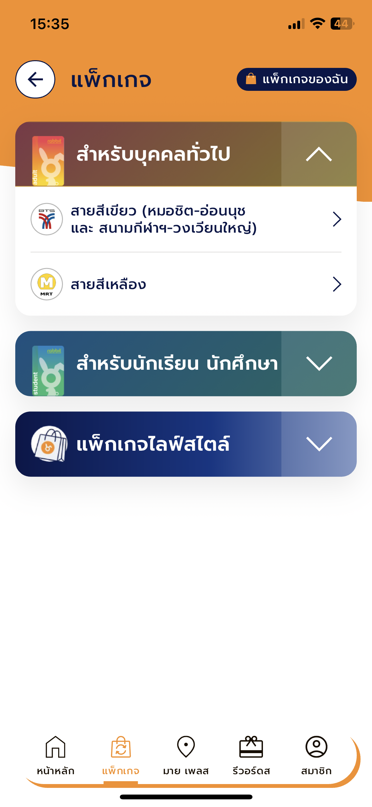

---

### EvRiderz, EvDriverz and EvMerchant

_Aug 2020 - Nov 2021_

**Description:**

A ride-hailing application that specializes in electric motorcycle (EV), that includes Rider (End-user), Driver and Merchant app.

**Responsibilities:**

- Developed core features for the Rider, Driver, and mostly Merchant applications.
- Integrated with a payment gateway.
- Established a WebSocket connection.

**Technologies:** [Android 12](https://developer.android.com/tools/releases/platforms#12), [Kotlin v1.6.0](https://github.com/JetBrains/kotlin/releases/tag/v1.6.0), [Websocket](https://github.com/centrifugal/centrifuge-java), [2C2P](https://developer.2c2p.com/docs/sdk-import-sdk)

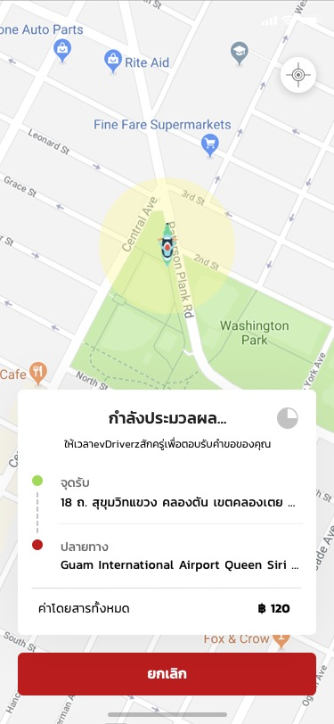
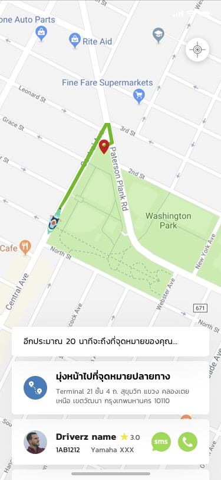
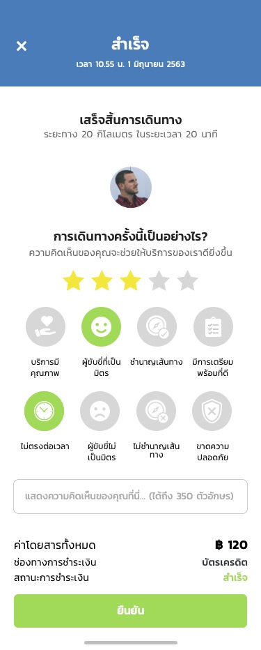

---

### Perfumist v3

_Mar 2019 - Dec 2022 (v3.3.1 - v4.0.50)_

**Description:**

A perfume advisory app that allows users to browse brands, models, fragrance notes, and concentration levels. It also has a Pro version for shop staff.

**Responsibilities:**

- Built Android apps that improve user experience and functionality with smart design and advanced technology.

**Technologies:** [Android 13](https://developer.android.com/tools/releases/platforms#13), [Kotlin v1.7.20](https://github.com/JetBrains/kotlin/releases/tag/v1.7.20)

**Link:** [Android](https://play.google.com/store/apps/details?id=com.smartsoftasia.perfume)

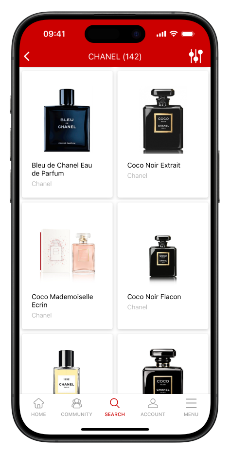
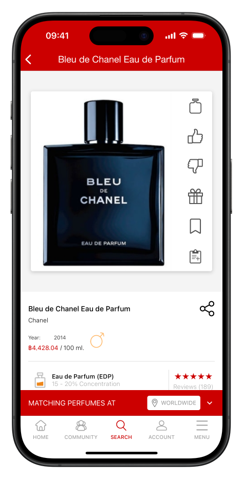
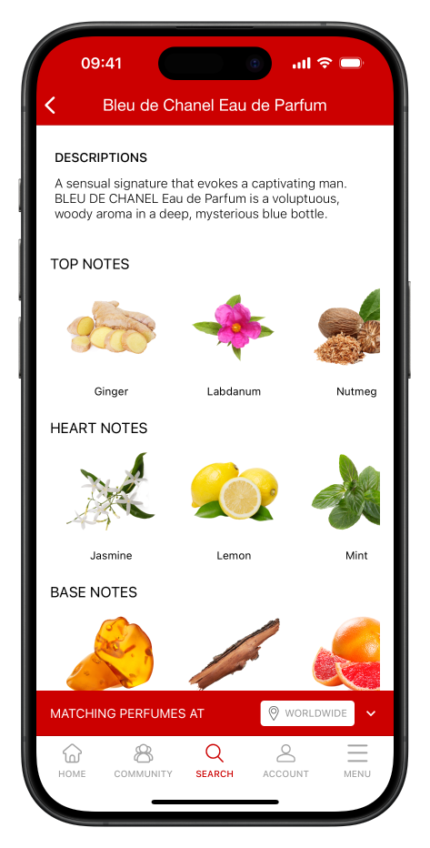

---

### Rabbit Rewards (Android)

_Aug 2018 - May 2023 (v4.0.0 - v4.4.6)_

**Description:**

Rabbit Rewards is an application mainly for redeeming points for rewards, featuring surveys, challenges, lucky draws, and more.

**Responsibilities:**

- Configured project environments.
- Built Android apps, improving functionality and user experience with modern design and tech.
- Efficiently assigned tasks to quickly implement required changes and add features, meeting project deadlines.

**Technologies:** [Android 13](https://developer.android.com/tools/releases/platforms#13), [Kotlin v1.7.10](https://github.com/JetBrains/kotlin/releases/tag/v1.7.10)

**Link:** [Android](https://play.google.com/store/apps/details?id=th.co.carrotrewards)

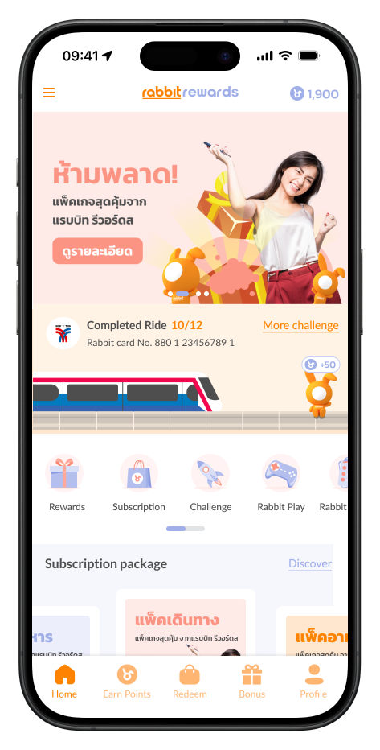
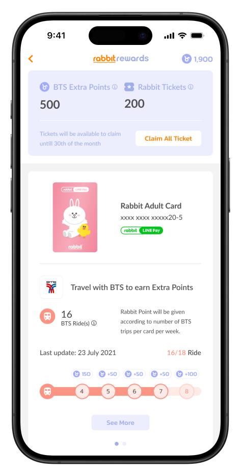
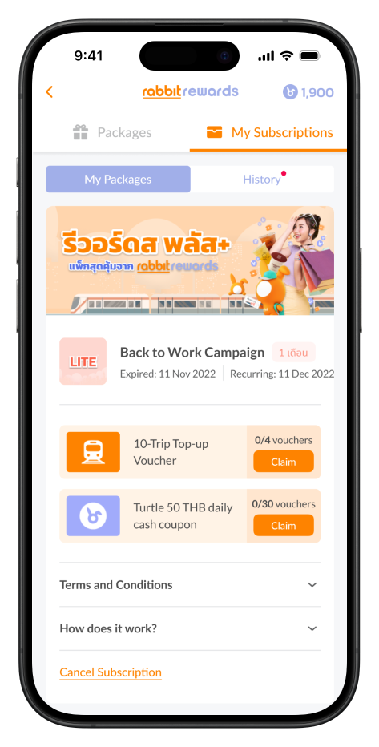

---

### Keyistar

_Apr 2018 - Feb 2020_

**Description:**

A mobile app for property listings, connecting buyers and sellers efficiently. Users can browse, list, and see a contact details.

**Responsibilities:**

- Configured project environments.
- Migrated to AndroidX.
- Developed several features.

**Technologies:** [Android 11](https://developer.android.com/tools/releases/platforms#11), [Kotlin v1.5.30](https://github.com/JetBrains/kotlin/releases/tag/v1.5.30)

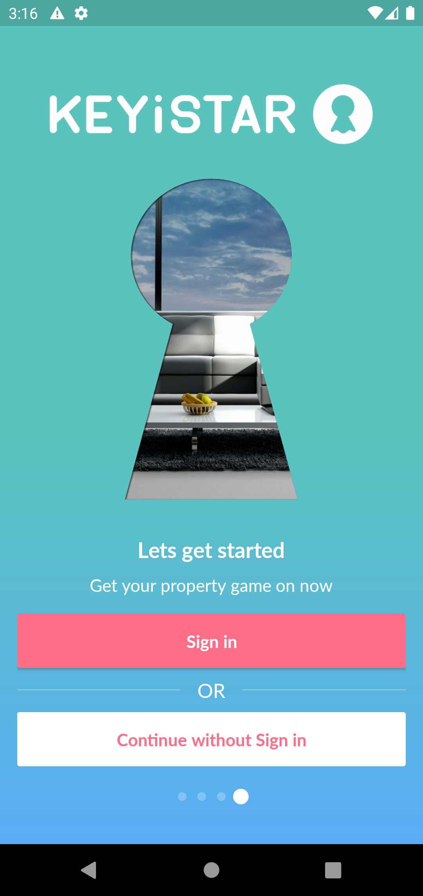
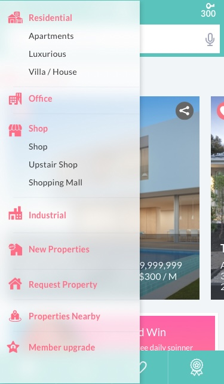

---

### JJ

_Jan 2018 - Jun 2018_

**Description:**

A marketplace mobile application specifically for the Chatuchak Market area.

**Responsibilities:**

- Developed several features.

**Technologies:** [Android 8.1](https://developer.android.com/tools/releases/platforms#8.1), [Kotlin v1.2.41](https://github.com/JetBrains/kotlin/releases/tag/v1.2.41)

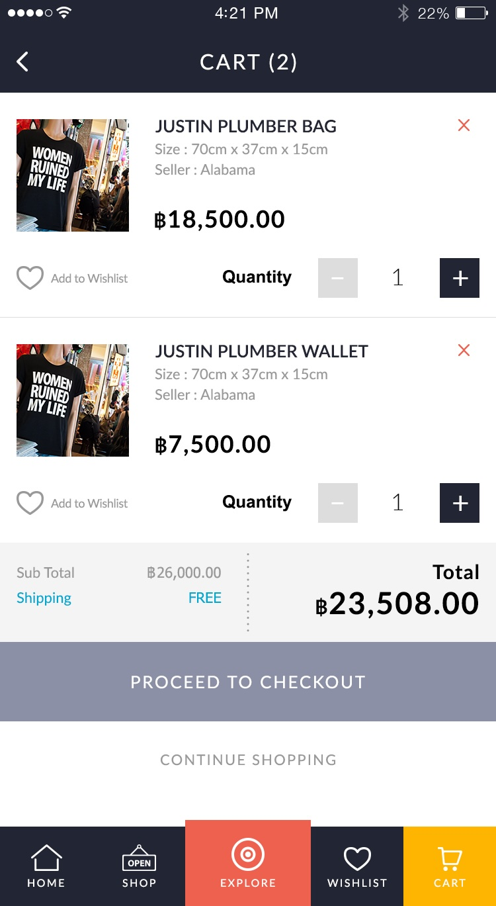

---

### Bemynt

_Aug 2017 - Mar 2018_

**Description:**

A fashion marketplace mobile application that can filter by gender, color, size, brand, and other related criteria.

**Responsibilities:**

- Developed several features.
- Integrated the Omise payment gateway.

**Technologies:** [Android 7.1](https://developer.android.com/tools/releases/platforms#7.1), [Kotlin v1.2.0](https://github.com/JetBrains/kotlin/releases/tag/v1.2.0), [Omise](https://github.com/omise/omise-android)

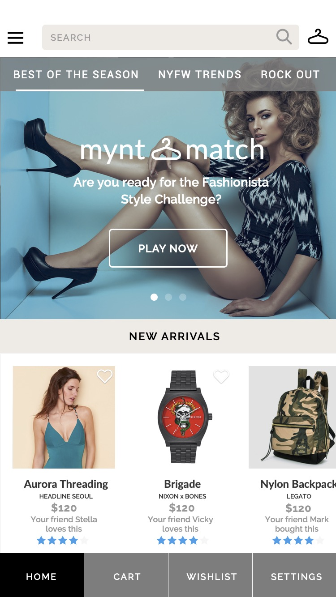
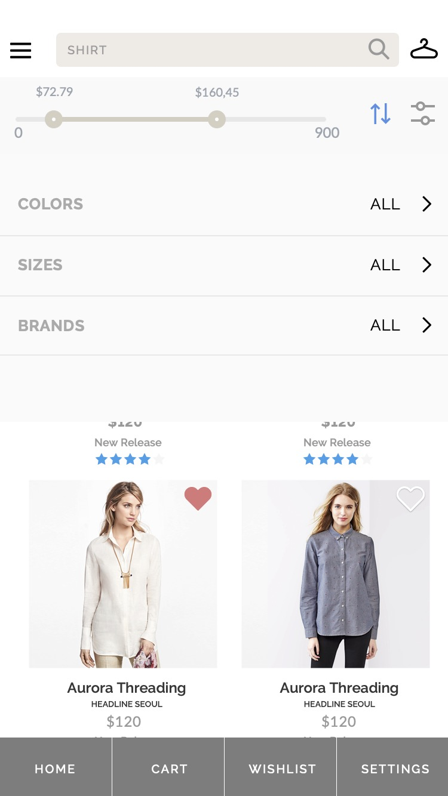

---

### More projects are coming soon.
