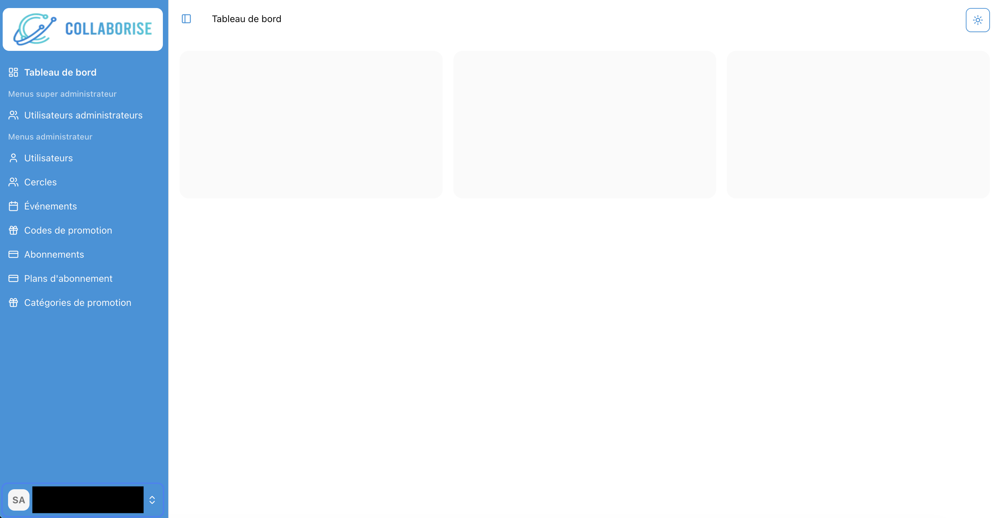

### Collaborise

_Nov 2025 - Feb 2026_

**Description:**

A social community platform to bring people in circle of trust. The website will allow people to help each other in these circles.

**Responsibilities:**

- Validate and review the database design to ensure alignment with project requirements.
- Developing a MVP despite unclear, evolving requirements and an undefined business algorithm for the circle-matching feature.

**Technologies:** [Next.js v15.2.8](https://github.com/vercel/next.js/), [shadcn-ui](https://github.com/shadcn-ui/ui), [next-auth](https://github.com/nextauthjs/next-auth), [prisma](https://github.com/prisma/prisma), [CASL](https://github.com/stalniy/casl), [tailwindcss](https://github.com/tailwindlabs/tailwindcss)

---

### AI Accounting

_Jan 2023 - Feb 2025_

**Description:**

A web application that uses an AI model to recognize a bill or receipt, pre-fill the data, and upload it to Xero accounting services.

**Responsibilities:**

- Design a workflow for a team.
- Develop a proof of concept (POC) for a Xero SDK.
- Manage CI/CD pipelines and the GCP platform for storage.

**Technologies:** [Next.js v14.1.0](https://github.com/vercel/next.js/), [RadixUI](https://github.com/radix-ui/themes), [next-auth](https://github.com/nextauthjs/next-auth), [prisma](https://github.com/prisma/prisma), [tailwindcss](https://github.com/tailwindlabs/tailwindcss), [Xero](https://www.xero.com)

---

### Keyistar

_Apr 2018 - Feb 2020_

**Description:**

A mobile app for property listings, connecting buyers and sellers efficiently. Users can browse, list, and see a contact details.

**Responsibilities:**

- Configured project environments.
- Migrated to AndroidX.
- Developed several features.

**Technologies:** [Android 11](https://developer.android.com/tools/releases/platforms#11), [Kotlin v1.5.30](https://github.com/JetBrains/kotlin/releases/tag/v1.5.30)

---

### JJ

_Jan 2018 - Jun 2018_

**Description:**

A marketplace mobile application specifically for the Chatuchak Market area.

**Responsibilities:**

- Developed several features.

**Technologies:** [Android 8.1](https://developer.android.com/tools/releases/platforms#8.1), [Kotlin v1.2.41](https://github.com/JetBrains/kotlin/releases/tag/v1.2.41)

---

### Guru Chat

_Jan 2017 - Aug 2017_

**Description:**

Guru Chat is an Android chat application focused on MLM users.

**Responsibilities:**

- Configured project environments.
- Developed all features using Smack, an open-source XMPP client library.

**Technologies:** [Android 7.1](https://developer.android.com/tools/releases/platforms#7.1), [Smack](https://www.igniterealtime.org/projects/smack/)

## 

---

### Dart Brunei

_Dec 2016 - Dec 2017 (v1.0.0 - v1.1.9)_

**Description:**

A ride-hailing application available in Brunei.

**Responsibilities:**

- Configured project environments.
- Integrated the AuthorizeNet payment gateway.
- Developed core features such as streaming locations, socket ride handle and etc.

**Technologies:** [Android 8.0](https://developer.android.com/tools/releases/platforms#8.0), [SocketIO](https://github.com/socketio/socket.io-client-java), [AuthorizeNet](https://github.com/AuthorizeNet/accept-sdk-android)

**Link:** [Play Store (Customer)](https://play.google.com/store/apps/details?id=com.dartbrunei.darttaxi.rider), [Play Store (Driver)](https://play.google.com/store/apps/details?id=com.dartbrunei.darttaxi.driver), [Youtube](https://www.youtube.com/watch?v=sptk5s88Vhk)

---

### DTM IOM

_May 2016 - Feb 2017_

**Description:**

A survey application for the International Organization for Migration.

**Responsibilities:**

- Developed a questionnaire feature with dynamic question types from the CMS.

**Technologies:** [Android 7.1](https://developer.android.com/tools/releases/platforms#7.1), [Realm](https://github.com/realm/realm-kotlin)

---

### Prompt Auto

_Feb 2016 - Aug 2017_

**Description:**

An emergency call for help to an insurance service involving a rider (end-user) and a driver.

**Responsibilities:**

- Developed both rider and driver application.

**Technologies:** [Android 7.1](https://developer.android.com/tools/releases/platforms#7.1)

---

### Perfumist v2

_Oct 2015 - Jan 2020 (v2.2.0 - v3.3.3)_

**Description:**

A perfume advisory app that allows users to browse brands, models, fragrance notes, and concentration levels.

**Responsibilities:**

- Built Android apps that improve user experience and functionality with smart design and advanced technology.

**Technologies:** [Android 8.1](https://developer.android.com/tools/releases/platforms#8.1)

**Link:** [Play Store](https://play.google.com/store/apps/details?id=com.smartsoftasia.perfume), [Youtube](https://www.youtube.com/watch?v=w14ooIPx5ts)

