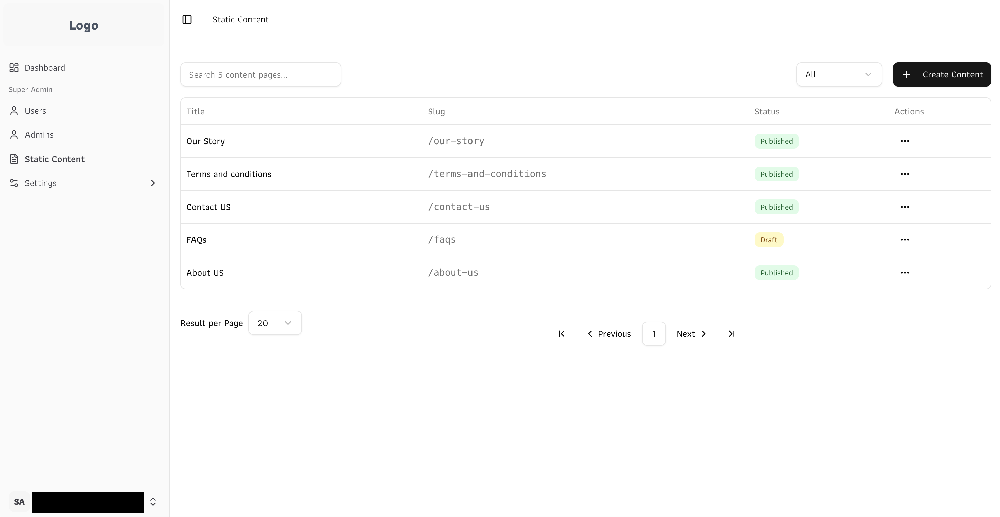

### Collaborise

_Nov 2025 - Present_

**Description:**

A social community platform to bring people in circle of trust. The website will allow people to help each other in these circles.

**Responsibilities:**

- Validate and review the database design to ensure alignment with project requirements.
- Developing a MVP despite unclear, evolving requirements and an undefined business algorithm for the circle-matching feature.

**Technologies:** [Next.js v15.2.8](https://github.com/vercel/next.js/), [shadcn-ui](https://github.com/shadcn-ui/ui), [next-auth](https://github.com/nextauthjs/next-auth), [prisma](https://github.com/prisma/prisma), [CASL](https://github.com/stalniy/casl), [tailwindcss](https://github.com/tailwindlabs/tailwindcss)

---

### NextJS Template

_Sep 2025 - Present_

**Description:**

A production-ready Next.js template featuring CASL, Tailwind CSS, shadcn/ui, Prisma, and NextAuth, designed for scalable web applications.

**Responsibilities:**

- Updated all libraries to latest versions.
- Developed a static content management system.
- Implemented all essential CI/CD scripts for AWS build, local build, and server build.

**Technologies:** [Next.js v16.0.1](https://github.com/vercel/next.js/), [shadcn-ui](https://github.com/shadcn-ui/ui), [next-auth](https://github.com/nextauthjs/next-auth), [prisma](https://github.com/prisma/prisma), [CASL](https://github.com/stalniy/casl), [tailwindcss](https://github.com/tailwindlabs/tailwindcss)

---

